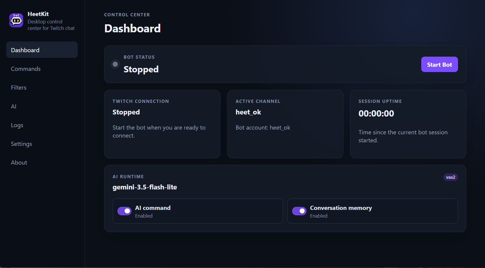

# HeetKit

### AI personalities and interactive Twitch chat from your desktop

HeetKit is a configurable desktop Twitch bot focused on entertainment and interactive chat.

Its main feature is a customizable Gemini-powered AI responder: create personalities, add profile-wide instructions, choose models, optionally keep conversation memory, and shape how the bot talks in your chat.

HeetKit also includes custom commands, useful chat utilities, permissions, cooldowns, filters, live logs, and a local desktop control panel.

> HeetKit is not affiliated with or endorsed by Twitch.

---

## Screenshot

---

## Features

- **Configurable AI chat** powered by Gemini
- **Custom AI personalities** with editable prompts and shared profile instructions
- **Custom Twitch commands** with aliases, responses, permissions and cooldowns
- **Useful chat commands** such as followage, weather, last seen and uptime
- **Conversation memory** for AI replies
- **Configurable chat and AI filters**
- **Desktop control panel** with live logs and tray controls
- **Local profiles** with separate settings and data

Gemini is optional. Normal Twitch commands work without an AI API key.

---

## Download

### Windows

Download the latest installer or portable version from:

**[Latest release](https://github.com/heeetz/heetkit-bot/releases/latest)**

You can also browse all available builds on the
**[Releases page](https://github.com/heeetz/heetkit-bot/releases)**.

Windows 10/11 x64 is the primary supported platform.

---

## Getting started

1. Install HeetKit or extract the portable build.
2. Connect a Twitch Developer application and choose the bot account and target channel.
3. Authorize the bot account through Twitch.
4. Optionally add a Gemini API key to enable AI chat.
5. Start the bot.

New to Twitch applications or Gemini API keys?

- **[Twitch setup guide](docs/twitch-setup.md)**
- **[AI / Gemini setup guide](docs/ai-setup.md)**

For HeetKit's current Twitch connection model, the bot account should have moderator access in the target channel. See the Twitch setup guide for details.

---

## Documentation

- [Twitch setup](docs/twitch-setup.md)
- [AI / Gemini setup](docs/ai-setup.md)
- [Commands and customization](docs/commands.md)
- [Data, profiles and privacy](docs/data-and-privacy.md)
- [Development and building from source](docs/development.md)
- [Release process](docs/release-process.md)

For bugs and feature requests, use
[GitHub Issues](https://github.com/heeetz/heetkit-bot/issues).

Security issues should be reported according to [SECURITY.md](SECURITY.md).

---

## About

HeetKit is created and maintained by **heeetz**.

- Twitch: [@heet_ok](https://www.twitch.tv/heet_ok)
- Discord: `de.tected`
- License: [Apache License 2.0](LICENSE)
- Third-party licenses: [THIRD_PARTY_NOTICES.md](THIRD_PARTY_NOTICES.md)

Contributions are welcome. See [CONTRIBUTING.md](CONTRIBUTING.md).
